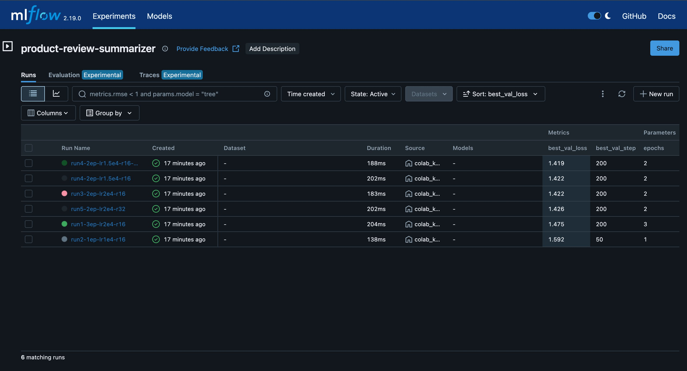
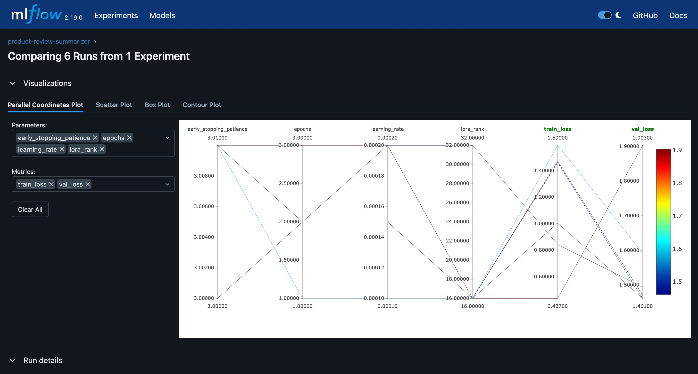

# Product Review Summarizer — QLoRA Fine-Tuned Mistral-7B

Fine-tuned Mistral-7B using QLoRA (4-bit, rank-16) on 3,000+ product reviews to generate structured summaries (pros, cons, verdict). Tracked 6 experiments with MLflow. Evaluated with ROUGE-L, BERTScore, and LLM-as-a-Judge scoring.

## Results

| Metric | Base Model | Fine-Tuned | Improvement |
|--------|-----------|------------|-------------|
| ROUGE-L F1 | 0.211 | 0.571 | **+170%** |
| BERTScore F1 | 0.866 | 0.954 | **+10.2%** |
| LLM-Judge Structure | 4.98/5 | 5.00/5 | +0.02 |
| LLM-Judge Conciseness | 3.96/5 | 4.76/5 | **+0.80** |

### Sample Output

**Input Review:**
> This tablet is decent for the price. The screen is bright and colorful, and the battery easily lasts 8 hours. However, the speakers are really tinny, and it gets noticeably slow when you have more than 3 apps open. The camera is basically useless in low light.

**Fine-Tuned Model Output:**
```
**Pros:**
- Bright and colorful screen
- Battery lasts 8 hours
- Decent for the price

**Cons:**
- Tinny speakers
- Noticeably slow with more than 3 apps
- Camera is useless in low light

**Verdict:** Overall, it's a decent tablet for basic use but has significant drawbacks.
```

## Experiment Tracking (MLflow)

Ran 6 experiments systematically varying epochs, learning rate, and LoRA rank:



### Parallel Coordinates — Hyperparameter to Metric Mapping



### Experiment Results

| Run | Epochs | LR | Rank | Best Val Loss | Finding |
|-----|--------|----|------|--------------|---------|
| Run 1 | 3 | 2e-4 | 16 | 1.475 | Overfit — val loss rose to 1.903 |
| Run 2 | 1 | 1e-4 | 16 | 1.592 | Underfit — model barely learned |
| Run 3 | 2 | 2e-4 | 16 | 1.422 | Good — 2 epochs is the sweet spot |
| **Run 4** | **2** | **1.5e-4** | **16** | **1.419** | **Winner — best generalization** |
| Run 5 | 2 | 2e-4 | 32 | 1.426 | Higher rank didn't help |

**Key Insight:** For ~1800 unique training examples, rank=16 with 2 epochs and lr=1.5e-4 is optimal. Higher rank adds capacity without improving generalization. Early stopping at patience=3 catches overfitting at step ~200 across all successful runs.

## Architecture

```
┌─────────────────────────────────────────────────────────────┐
│                     DATA PIPELINE                           │
│                                                             │
│  Amazon Polarity ──→ Clean + Filter ──→ GPT-4o-mini ──→    │
│  (3.6M reviews)     English only       Label Generation     │
│                     100-1000 chars     (Pydantic validated)  │
│                                             │               │
│                     Balance + Stratified Split               │
│                     Train: 1400+ │ Val: 180 │ Test: 187     │
└─────────────────────────────────────────────────────────────┘
                              │
                              ▼
┌─────────────────────────────────────────────────────────────┐
│                   TRAINING PIPELINE                          │
│                                                             │
│  Mistral-7B-Instruct-v0.3 (4-bit NF4 quantized)           │
│       │                                                     │
│       ├── LoRA Adapters (r=16, α=16)                       │
│       │   Target: q, k, v, o, gate, up, down projections   │
│       │   Trainable: 42M / 7.2B params (0.58%)             │
│       │                                                     │
│       ├── SFTTrainer + Unsloth (2x faster)                 │
│       │   AdamW 8-bit, cosine scheduler, warmup=30         │
│       │                                                     │
│       └── MLflow Experiment Tracking                        │
│           6 runs, early stopping, stratified evaluation     │
└─────────────────────────────────────────────────────────────┘
                              │
                              ▼
┌─────────────────────────────────────────────────────────────┐
│                  EVALUATION PIPELINE                         │
│                                                             │
│  ROUGE-L ────→ Surface overlap (+170% vs base)             │
│  BERTScore ──→ Semantic similarity (+10.2% vs base)        │
│  LLM Judge ──→ Structure, accuracy, completeness (GPT-4o)  │
└─────────────────────────────────────────────────────────────┘
                              │
                              ▼
┌─────────────────────────────────────────────────────────────┐
│                  SERVING (vLLM)                              │
│                                                             │
│  vLLM Server ──→ OpenAI-compatible API                     │
│  LoRA adapter serving (no merge needed)                     │
│  Docker + docker-compose for production                     │
│  See serving/ directory for deployment files                │
└─────────────────────────────────────────────────────────────┘
```

## Project Structure

```
product-review-summarizer/
├── README.md
├── requirements.txt
├── configs/
│   └── training_config.yaml        # Hyperparameters for the winning run
├── src/
│   ├── data_prep.py                # Data loading, cleaning, language filtering
│   ├── label_generation.py         # GPT-4o-mini labeling with Pydantic validation
│   ├── train.py                    # QLoRA training with MLflow logging
│   └── evaluate.py                 # ROUGE-L, BERTScore, LLM-as-judge
├── notebooks/
│   ├── 01_data_pipeline.ipynb      # Interactive data preparation
│   ├── 02_training.ipynb           # Training experiments
│   └── 03_evaluation.ipynb         # Model evaluation
├── serving/
│   ├── serve.py                    # vLLM API server launcher
│   ├── client.py                   # Example API client
│   ├── Dockerfile                  # Production container
│   ├── docker-compose.yml          # One-command deployment
│   └── README.md                   # Deployment instructions
├── evaluation/
│   └── eval_results.json           # All metric scores
└── screenshots/
    ├── mlflow_runs_table.png       # MLflow experiment comparison
    └── mlflow_parallel_coords.png  # Hyperparameter visualization
```

## Quick Start

### 0. Environment Setup
```bash
cp .env.example .env
# Edit .env and add your API keys
```

### 1. Data Pipeline
```bash
# No GPU needed — runs on CPU
pip install datasets pandas langdetect openai pydantic

# Open notebook
jupyter notebook notebooks/01_data_pipeline.ipynb
```

### 2. Training (requires NVIDIA GPU)
```bash
pip install "unsloth[colab-new] @ git+https://github.com/unslothai/unsloth.git"
pip install --no-deps xformers trl peft accelerate bitsandbytes triton
pip install mlflow==2.19.0

# Open notebook (or run the script)
jupyter notebook notebooks/02_training.ipynb

# Or run directly:
python src/train.py --config configs/training_config.yaml
```

### 3. Evaluation (requires NVIDIA GPU for BERTScore)
```bash
pip install rouge-score bert-score openai

python src/evaluate.py --adapter-path ./adapters_run4-2ep-lr1.5e4-r16
```

### 4. Serving (requires NVIDIA GPU)
```bash
# Option A: Direct vLLM
pip install vllm
python serving/serve.py --adapter-path ./adapters_run4-2ep-lr1.5e4-r16

# Option B: Docker
cd serving && docker compose up --build

# Test the API
python serving/client.py --review "Great laptop but heavy" --rating 4
```

## Technologies

| Category | Tools |
|----------|-------|
| Base Model | Mistral-7B-Instruct-v0.3 |
| Fine-Tuning | QLoRA (4-bit NF4), LoRA rank=16 |
| Training | Unsloth, HuggingFace PEFT, TRL SFTTrainer |
| Data Labeling | GPT-4o-mini with Pydantic schema validation |
| Experiment Tracking | MLflow 2.19 (SQLite backend) |
| Evaluation | ROUGE-L, BERTScore (roberta-large), LLM-as-Judge (GPT-4o-mini) |
| Serving | vLLM with LoRA adapter support |
| Deployment | Docker, docker-compose |

## Training Details

- **Dataset:** 3,000 Amazon product reviews (Amazon Polarity), balanced across sentiments, English-only (langdetect filtered)
- **Labels:** Generated via GPT-4o-mini distillation, validated with Pydantic schema (type checking, rating clamping 1-5, empty list handling)
- **Quantization:** 4-bit NF4 (Normal Float 4-bit) — reduces base model from 14GB to 3.5GB VRAM
- **LoRA Config:** rank=16, alpha=16, targets all linear layers (q, k, v, o, gate, up, down), trainable params: 42M (0.58% of 7.2B)
- **Training:** AdamW 8-bit optimizer, cosine LR schedule, warmup=30 steps, weight_decay=0.01
- **Best Run:** 2 epochs, lr=1.5e-4, early stopping patience=3, best checkpoint at step 200
- **Hardware:** Google Colab T4 (16GB VRAM), ~30 min per experiment

## Cost Breakdown

| Item | Cost |
|------|------|
| Amazon Polarity dataset | Free (open source) |
| Mistral-7B model weights | Free (Apache 2.0) |
| All libraries (Unsloth, PEFT, etc.) | Free (open source) |
| Google Colab GPU (training) | Free (T4 tier) |
| GPT-4o-mini labels (3000 reviews) | ~$0.50 |
| GPT-4o-mini evaluation (LLM judge) | ~$1.00 |
| **Total** | **~$1.50** |

## Key Design Decisions

| Decision | Alternatives Considered | Rationale |
|----------|------------------------|-----------|
| QLoRA (4-bit) over full LoRA (16-bit) | Full fine-tuning, LoRA 16-bit | 4x memory reduction (14GB → 3.5GB) with no measurable quality loss. Enables training on free Colab T4. |
| GPT-4o-mini for label generation | Human annotation, rule-based extraction | $0.50 for 3000 labels vs $3000+ for human annotators. Pydantic validation catches malformed outputs at the source. |
| Rank 16 over rank 32 | r=8, r=32, r=64 | Experimentally validated: r=32 (val loss 1.426) showed no improvement over r=16 (val loss 1.419). Lower rank = smaller adapter, faster inference. |
| 2 epochs with early stopping | 1 epoch, 3 epochs | 3 epochs overfit (val loss 1.475 → 1.903). 1 epoch underfit (val loss stuck at 1.592). 2 epochs + patience=3 converges at step 200. |
| Stratified split with oversampling | Random split, downsampling | Rating-3 had only 48 examples. Stratified split ensures test set represents all ratings. Oversampling applied to training set only. |
| Multiple evaluation metrics | ROUGE-L only | ROUGE-L captures format adherence (+170%). BERTScore captures semantic quality (+10.2%). LLM-judge reveals tradeoffs (conciseness vs completeness). |
